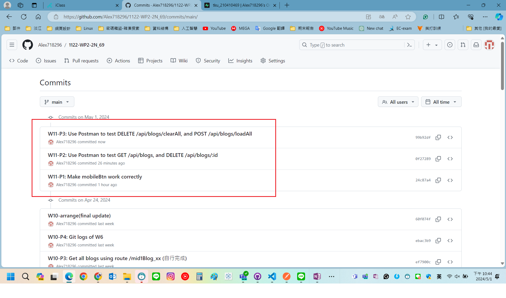

[My GitHub URL](https://github.com/Alex718296/1122-WP2-2N_69)

### W11-P1: Make mobileBtn work correctly


```
c1b5cab htchung Wed May 1 19:32:40 2024 +0800   W11-P1: Make mobileBtn work correctly
```

### W11-P2: Use Postman to test GET /api/blogs, and DELETE /api/blogs/:id


```
002dd42 htchung Wed May 1 20:39:18 2024 +0800   W11-P2: Use Postman to test GET /api/blogs, and DELETE /api/blogs/:id

```

---

### W11-P3: Use Postman to test DELETE /api/blogs/clearAll, and POST /api/blogs/loadAll

#### => test DELETE /api/blogs/clearAll


#### => test POST /api/blogs/loadAll


```
849f9a5 htchung Wed May 1 21:24:48 2024 +0800   W11-P3: Use Postman to test DELETE /api/blogs/clearAll, and POST /api/blogs/loadAll
```

---

### W11-P4: Git logs of W11



```
git log --pretty=format:"%h%x09%an%x09%ad%x09%s" --after="2024-04-30"

849f9a5 htchung Wed May 1 21:24:48 2024 +0800   W11-P3: Use Postman to test DELETE /api/blogs/clearAll, and POST /api/blogs/loadAll
002dd42 htchung Wed May 1 20:39:18 2024 +0800   W11-P2: Use Postman to test GET /api/blogs, and DELETE /api/blogs/:id
c1b5cab htchung Wed May 1 19:32:40 2024 +0800   W11-P1: Make mobileBtn work correctly

```
