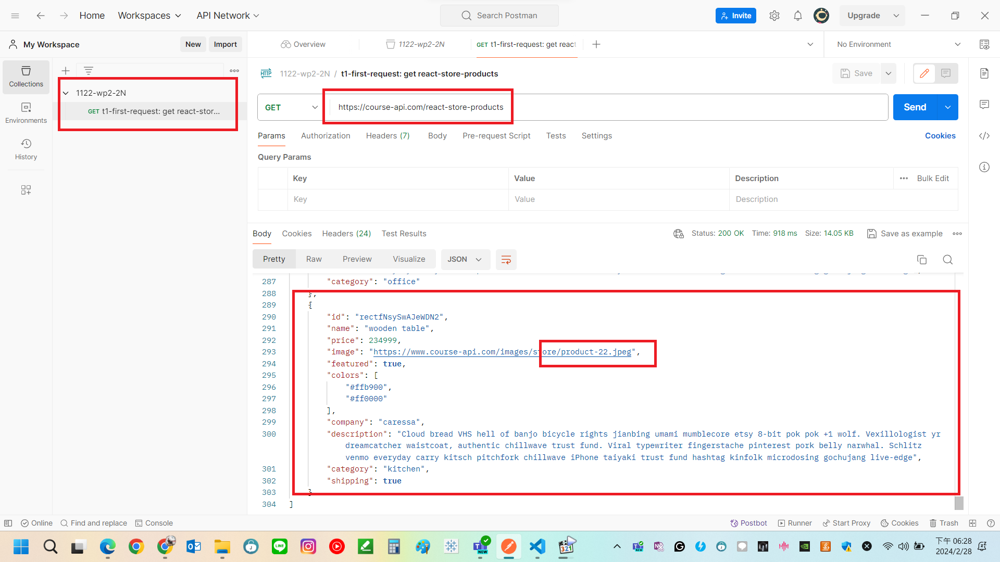
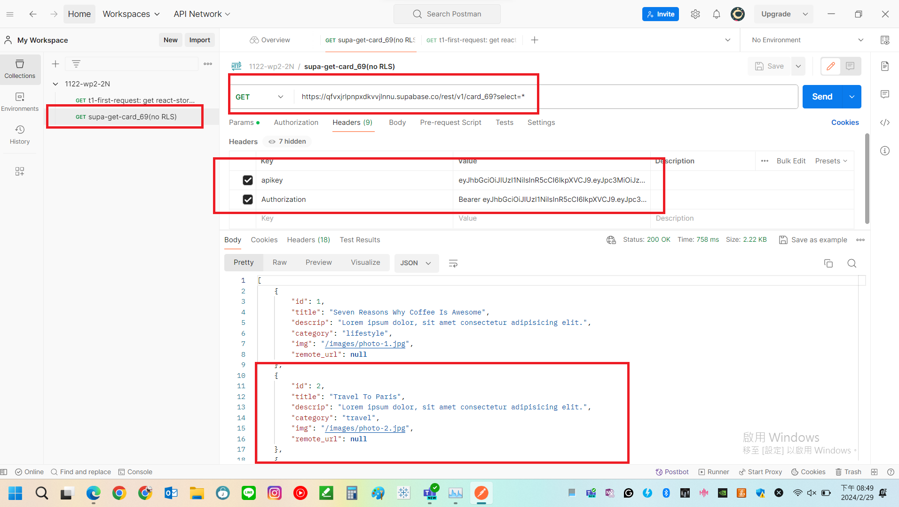

[My GitHub URL](https://github.com/Alex718296/1122-WP2-2N_69)

### W1-P1: Get Request demo in Postman



```
199c62d htchung Wed Feb 21 19:19:57 2024 +0800  W1-P1: Get Request demo in Postman
```

### W1-P2: Read card_xx table in Supabase



```
a7f7477 htchung Wed Feb 21 19:47:55 2024 +0800  W1-P2: Read card_xx table in Supabase
```
