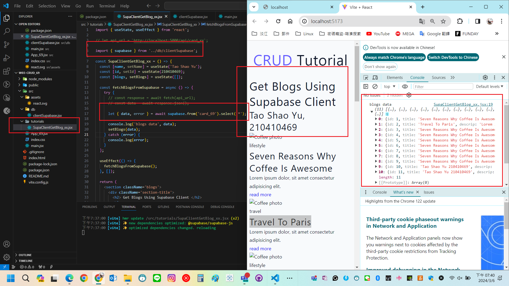
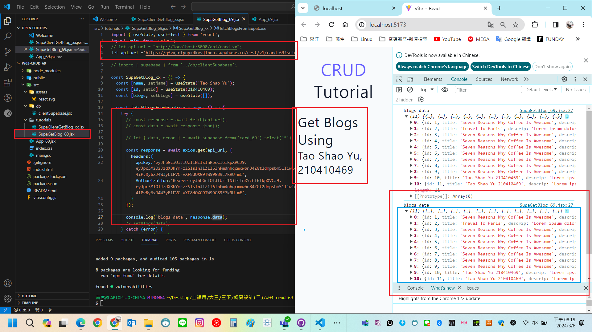
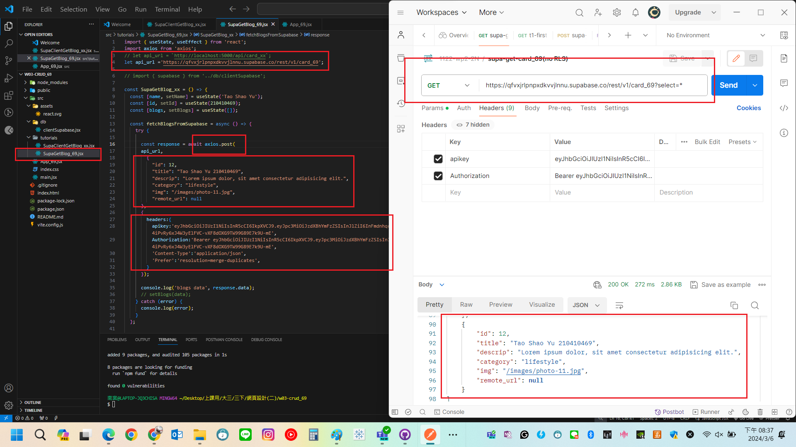
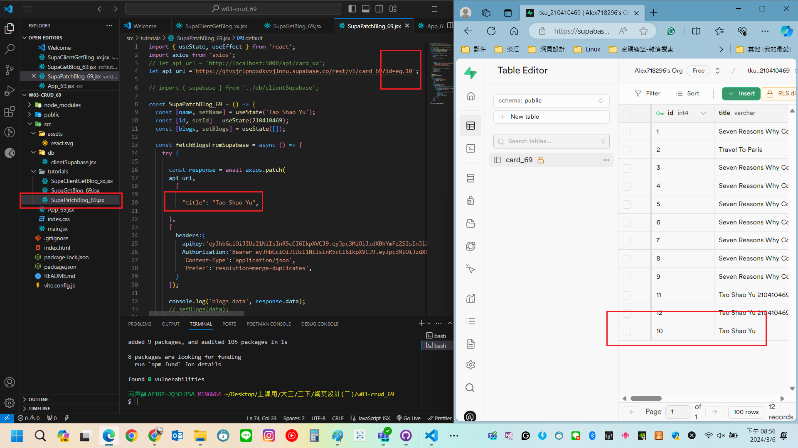
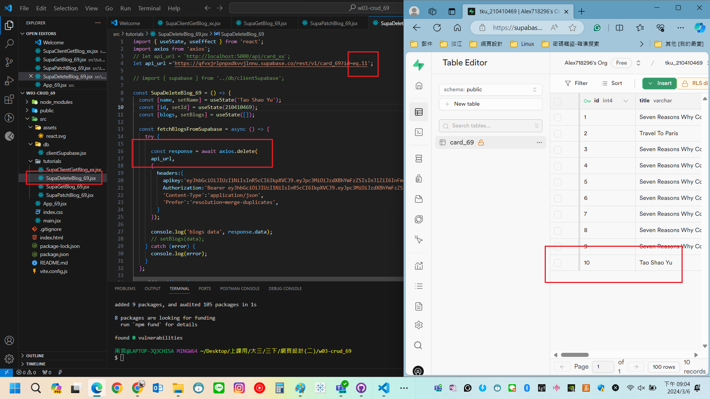

[My GitHub URL](https://github.com/Alex718296/1122-WP2-2N_69)

### W3-P1: Use SupaClientGetBlog_xx.jsx (supabase client) to get card_xx data



```
beac8d8 htchung Wed Mar 6 19:18:05 2024 +0800   W3-P1: Use SupaClientGetBlog_xx.jsx (supabase client) to get card_xx data
```

### W3-P2: Use SupaGetBlog_xx.jsx to get card_xx data



```
28d423a htchung Wed Mar 6 19:56:53 2024 +0800   W3-P2: Use SupaGetBlog_xx.jsx to get card_xx data
```

### W3-P3: Use SupaPostBlog_xx.jsx to add blog data



```
683eb54 htchung Wed Mar 6 20:18:40 2024 +0800   W3-P3: Use SupaPostBlog_xx.jsx to add blog data
```

### W3-P4: Use SupaPatchBlog_xx.jsx to modify blog data



```
406ffd1 htchung Wed Mar 6 20:42:56 2024 +0800   W3-P4: Use SupaPatchBlog_xx.jsx to modify blog data
```

### W3-P5: Use SupaDeleteBlog_xx.jsx to delete blog data



```
fc45a84 htchung Wed Mar 6 20:44:53 2024 +0800   W3-P5: Use SupaDeleteBlog_xx.jsx to delete blog data
```
