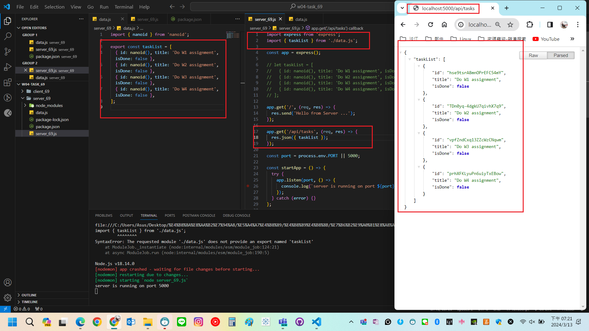
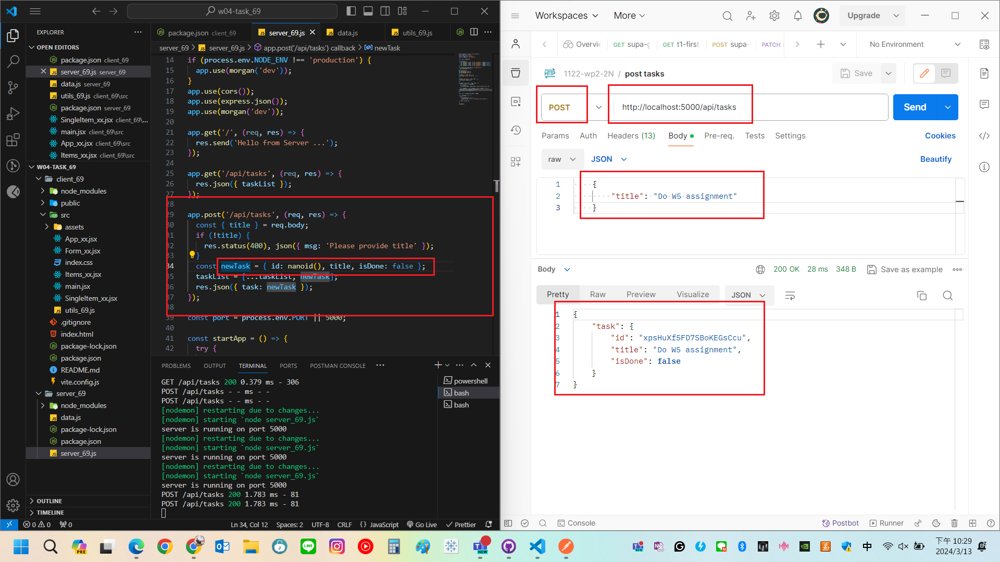
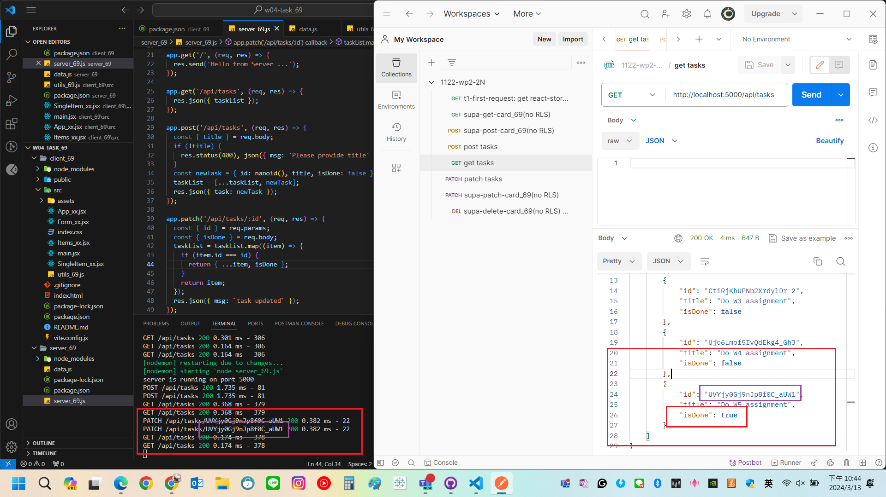

[My GitHub URL](https://github.com/Alex718296/1122-WP2-2N_69)

### W4-P1: Server: implement GET /api/tasks



```
1cb9969 htchung Wed Mar 13 18:58:29 2024 +0800  W4-P1: Server: implement GET
/api/tasks
```

### W4-P2: Server: implement POST /api/tasks



```
330d441 htchung Wed Mar 13 20:57:15 2024 +0800  W4-P2: Server: implement POST /api/tasks
```

### W4-P3: Server: implement PATCH /api/tasks/:id



```
bf5be39 htchung Wed Mar 13 21:38:16 2024 +0800  W4-P3: Server: implement PATCH /api/tasks/:id
```
