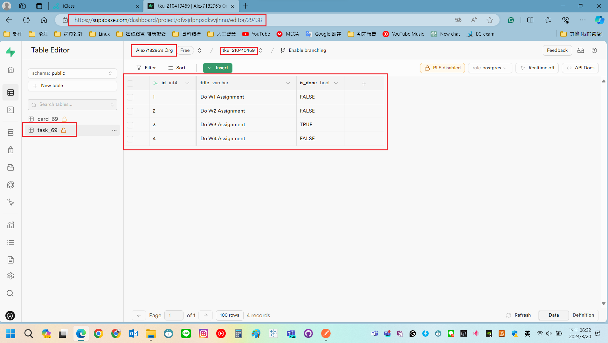
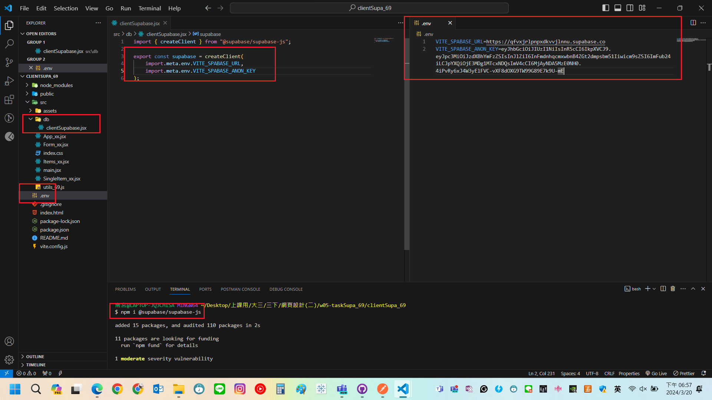
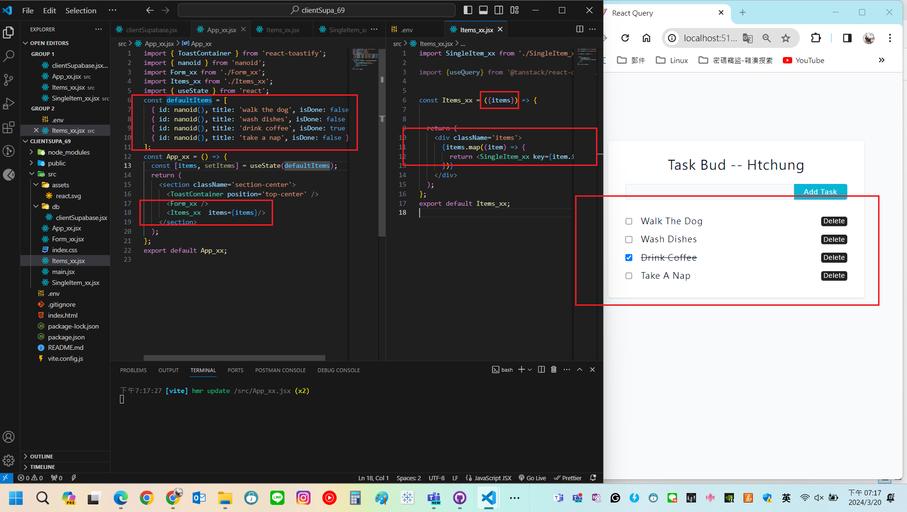
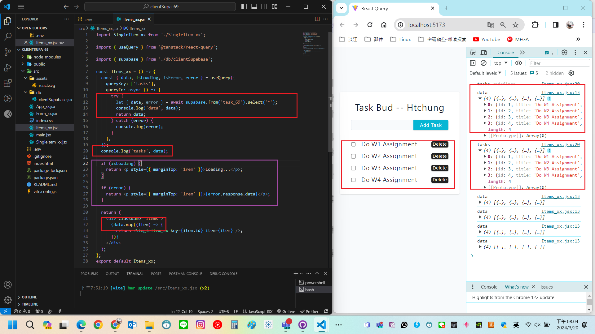
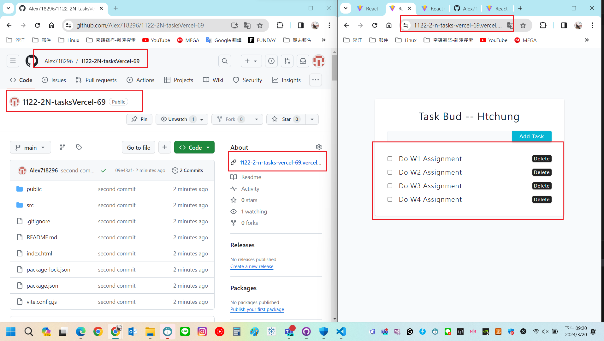

[My GitHub URL](https://github.com/Alex718296/1122-WP2-2N_69)

### W5-P1: Create task_xx table in Supabase with 4 data using SQL



```
2ccc1fa htchung Wed Mar 20 18:36:26 2024 +0800  W5-P1: Create task_xx table in Supabase with 4 data using SQL
```

---

### W5-P2: Use React Query to get tasks data from Supabase







```
7d57a5d htchung Wed Mar 20 20:06:16 2024 +0800  W5-P2: Use React Query to get tasks data from Supabase
```

### W5-P3: Deploy W5-P2 to Vercel



```
ccf464e htchung Wed Mar 20 20:30:00 2024 +0800  W5-P3: Deploy W5-P2 to Vercel
```

---
