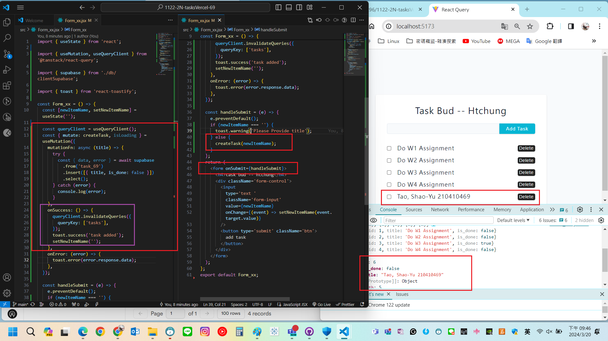
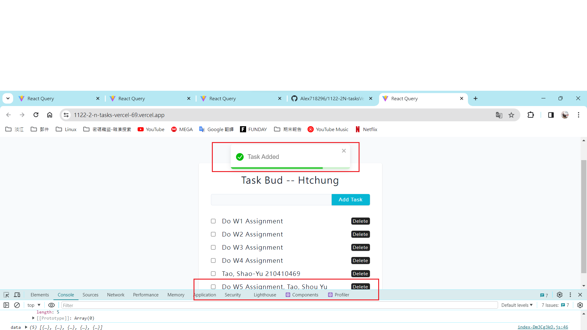

[My GitHub URL](https://github.com/Alex718296/1122-WP2-2N_69)

### W5-P1: Create task_xx table in Supabase with 4 data using SQL


```
2ccc1fa htchung Wed Mar 20 18:36:26 2024 +0800  W5-P1: Create task_xx table in Supabase with 4 data using SQL
```

---

### W5-P2: Use React Query to get tasks data from Supabase


```
7d57a5d htchung Wed Mar 20 20:06:16 2024 +0800  W5-P2: Use React Query to get tasks data from Supabase
```

### W5-P3: Deploy W5-P2 to Vercel


```
ccf464e htchung Wed Mar 20 20:30:00 2024 +0800  W5-P3: Deploy W5-P2 to Vercel
```

---

### W5-P4: Create new Task, deploy W5-P3 to Vercel

#### => local



#### => vercel



```
01c18cb htchung Wed Mar 20 21:24:34 2024 +0800  W5-P4: Create new Task, deploy W5-P3 to Vercel
```

---

### W5-P5: Git logs of W5

git log --pretty=format:"%h%x09%an%x09%ad%x09%s" --after="2024-03-19"
6cfe724 Alex718296 Wed Mar 20 22:02:03 2024 +0800 W5-P4: Create new Task, deploy W5-P3 to Vercel
2fb53de Alex718296 Wed Mar 20 21:23:11 2024 +0800 W5-P3: Deploy W5-P2 to Vercel
ca16a49 Alex718296 Wed Mar 20 20:08:45 2024 +0800 W5-P2: Use React Query to get tasks data from Supabase
a2682cd Alex718296 Wed Mar 20 18:38:20 2024 +0800 W5-P1: Create task_xx table in Supabase with 4 data using SQL
