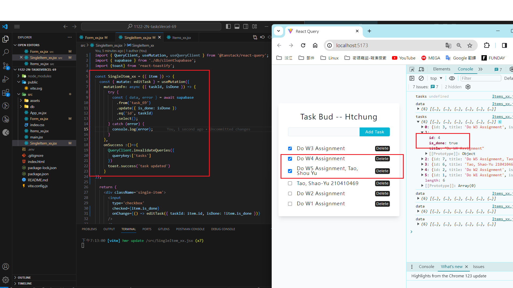

[My GitHub URL](https://github.com/Alex718296/1122-WP2-2N_69)

### W6-P1: Update a task in Supabase



```
937854b htchung Wed Mar 27 19:16:13 2024 +0800  W6-P1: Update a task in Supabase
```

---

### W6-P2: Delete a task in Supabase

#### => local


#### => Vercel: insert a task, edit the task, delete the task


```
937854b htchung Wed Mar 27 19:16:13 2024 +0800  W6-P1: Update a task in Supabase
```

---
