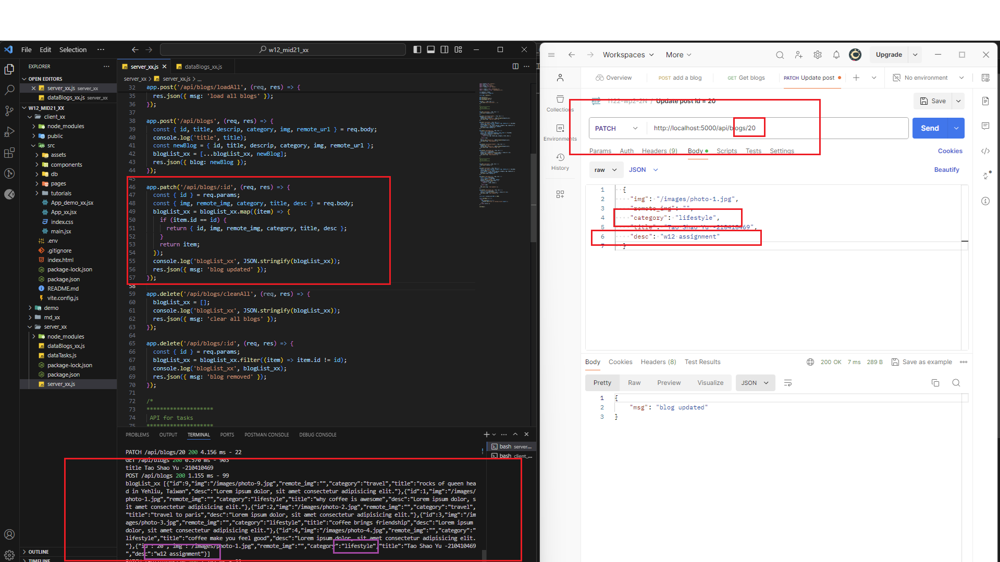
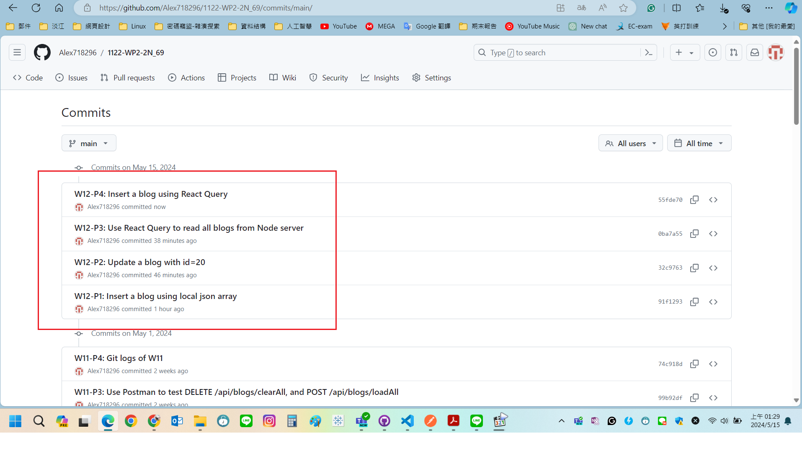

[My GitHub URL](https://github.com/Alex718296/1122-WP2-2N_69)

### W12-P1: Insert a blog using local json array


```
495c513 htchung Wed May 8 19:33:03 2024 +0800   W12-P1: Insert a blog using local json array
```

---

### W12-P2: Update a blog with id=20



```
b78eb00 htchung Wed May 8 20:09:48 2024 +0800   W12-P2: Update a blog with id=20
```

---

### W12-P3: Use React Query to read all blogs from Node server


```
6a83daa htchung Wed May 8 20:41:11 2024 +0800   W12-P3: Use React Query to read all blogs from Node server
```

---

### v


```
4579bad htchung Wed May 8 21:16:31 2024 +0800   W12-P4: Insert a blog using React Query
```

### W12-P5: Git logs of W11


