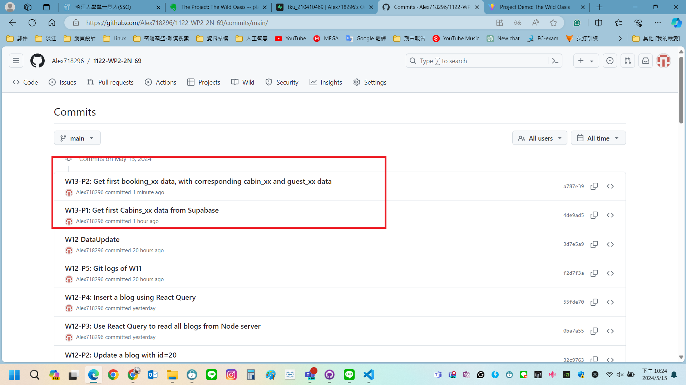

[My GitHub URL](https://github.com/Alex718296/1122-WP2-2N_69)

### W13-P1: Get first Cabins_xx data from Supabase


```
22d5e74 htchung Wed May 15 20:22:36 2024 +0800  W13-P1: Get first Cabins_xx data from Supabase
```

---

### W13-P2: Get first booking_xx data, with corresponding cabin_xx and guest_xx data


```
1d6b8e7 htchung Wed May 15 21:12:23 2024 +0800  W13-P2: Get first booking_xx data, with corresponding cabin_xx and guest_xx data
```

---

### W13-P3: Git logs of W13



```
git log --pretty=format:"%h%x09%an%x09%ad%x09%s" --after="2024-05-14"


1d6b8e7 htchung Wed May 15 21:12:23 2024 +0800  W13-P2: Get first booking_xx data, with corresponding cabin_xx and guest_xx data
22d5e74 htchung Wed May 15 20:22:36 2024 +0800  W13-P1: Get first Cabins_xx data from Supabase
```
